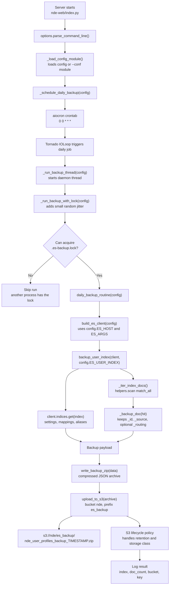
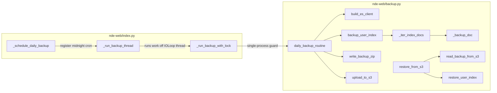
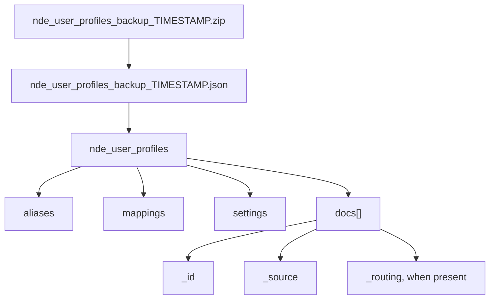

# Daily S3 Backup Workflow

This visual explains the daily Elasticsearch backup added in PR #35. The job
backs up only the production user-profile index and uploads a zipped JSON
archive to `s3://nde/es_backup/`.

## Function Map

## Archive Shape

Each uploaded `.zip` contains one JSON file. The JSON is keyed by the
Elasticsearch index name so restore tooling can recreate the index metadata and
then replay documents.

## Explanation Script

1. When the API process starts, `index.py` registers a midnight cron job on the
   same Tornado event loop used by the server.
2. When the cron fires, the work moves into a daemon thread so the server loop
   is not blocked.
3. The thread tries to acquire `.es-backup.lock`. If another process already has
   it, this process skips the run.
4. The backup routine builds a synchronous Elasticsearch client from the normal
   app config.
5. The user-profile index metadata and every document are exported into a
   zipped JSON archive.
6. The archive is uploaded to the existing `nde` S3 bucket under `es_backup/`.
7. Retention and storage-class transitions for uploaded backups are handled by
   the S3 bucket lifecycle policy.
8. To restore, `restore_from_s3(config)` downloads the latest backup object by
   default, reads the zipped JSON payload, and bulk-indexes the saved documents
   into the configured user-profile index.
